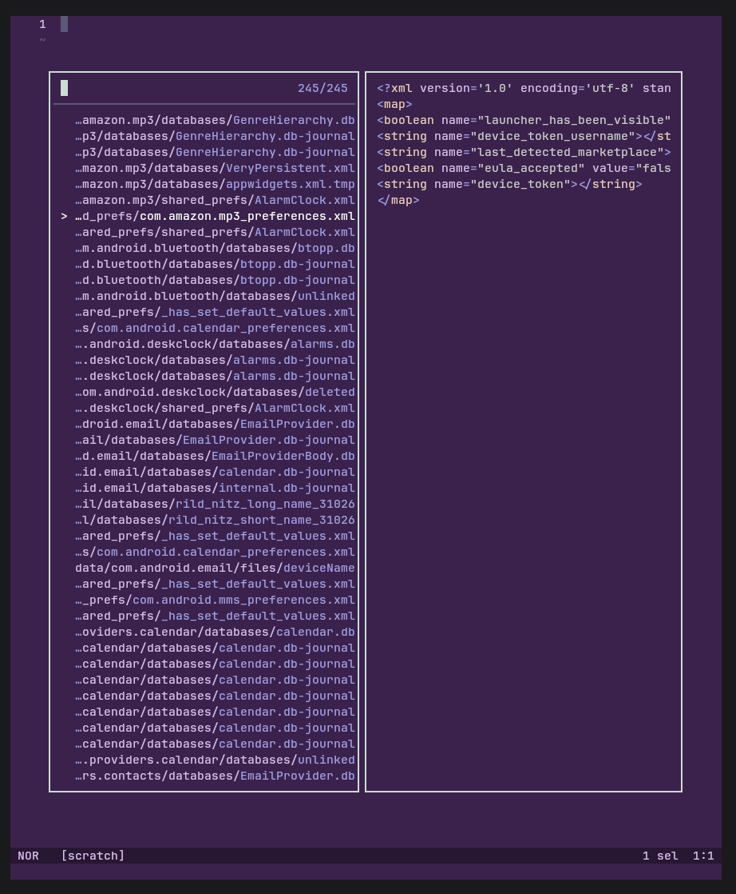
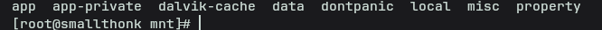
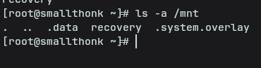
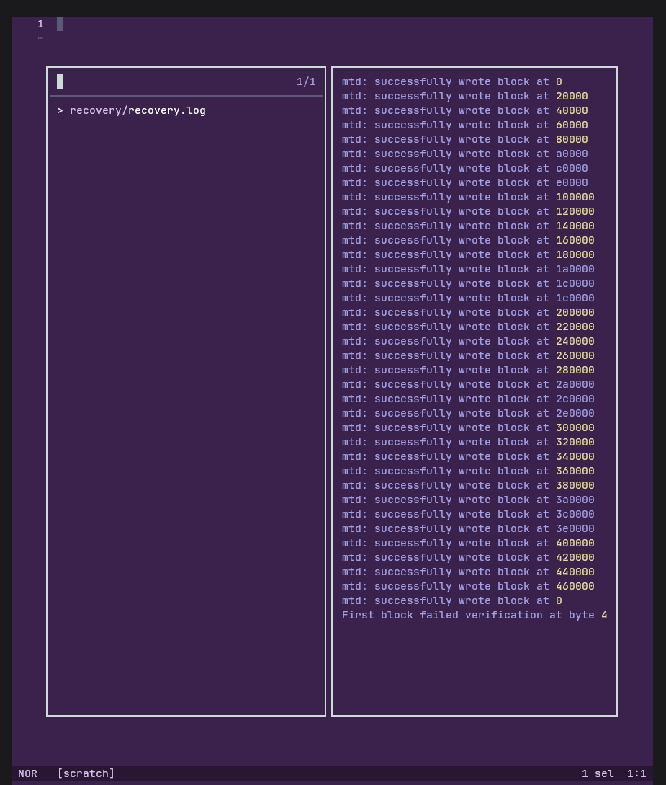

# Dokumentation

Das ist meine Dokumentation für Prüfungsoption B Digitale Forensik.
Ziel ist es, einen eigenen Yaffs2 Treiber zu schreiben, um nexus.nanddump und 1.bin, eine Partition in a2019-gh2-full.bin auszulesen.
Hierfür wurde mithilfe von Rust ein Fuse-Treiber geschrieben, welcher mit verschiedenen Layouts umgehen kann.

# Demonstration

## nexus.nanddump
Ansicht in Helix:

LS von nexus.nanddump:

---

## 1.bin
Ansicht im Terminal:

Ansicht in Helix:

# Repo
https://github.com/Big-Smarty/yaffs2_fuse